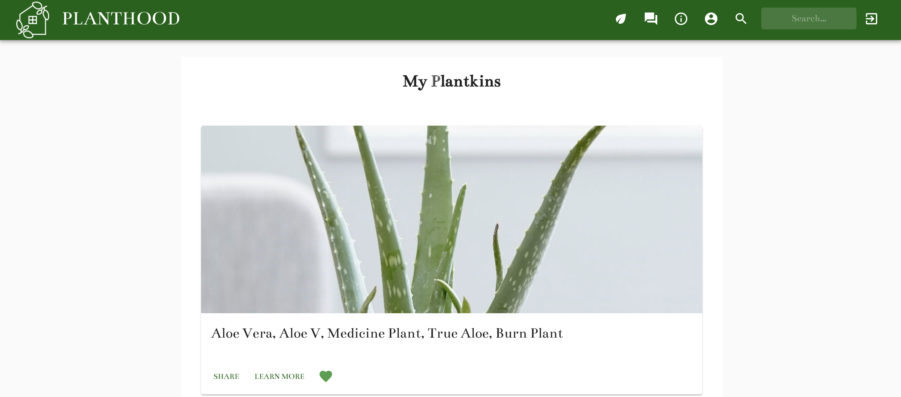

  

## PLANTHOOD

<table>
<tr>
<td>
  A React App that allows you to search plants from a database and add them to your page.  Gives user the ability to grant access to a plant sitter.
</td>
</tr>
</table>

## Take it for a spin.

Here is a working live demo : https://planthood.herokuapp.com/

## Contributions

Want to contribute? Great!

To fix a bug or enhance an existing module, follow these steps:

- Fork the repo
- Create a new branch (`git checkout -b improve-feature`)
- Make the appropriate changes in the files
- Add changes to reflect the changes made
- Commit your changes (`git commit -am 'Improve feature'`)
- Push to the branch (`git push origin improve-feature`)
- Create a Pull Request

## Built with

- [React - Material UI](https://reactjs.org/)

- [MongoDB](https://www.mongodb.com/)

- [Node - Express](https://nodejs.org/en/)

## Crew

<a href="https://github.com/">Emanuil Vartanyan</a>

<a href="https://www.funches.org/">Martin Funches</a>

<a href="https://github.com/skrantzz">Sydney Krantz</a>

<a href="https://github.com/AnnaOlt">Anna Olt</a>

<a href="https://github.com/stephdedios">Stephanie De Dios</a>

<a href="https://github.com/thetntm">Michael Becker</a>
